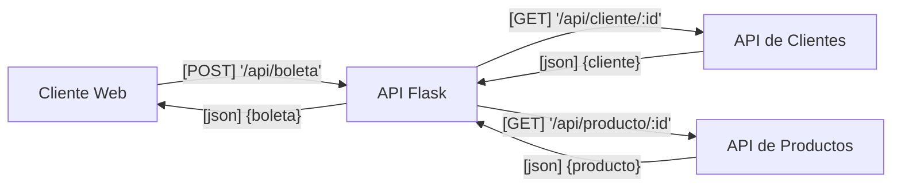

# TALLER: Desarrollo de APIs en C#

## Parte 1
En Visual Studio (VS) crear un API para Clientes que contenga las siguientes características:

- Generar un Controlador exclusivo de `Cliente`
- Crear una Lista de Clientes estática (`IList<Clientes>`) dentro del controlador.
- GET para Obtener un listado de `Cliente`.
- GET con `ID` para Obtener un `Cliente`
- POST con un `JSON` de un `Cliente` para insertar.
- PUT con `ID` y `JSON` para actualizar un `Cliente`.
- DELETE con `ID` para eliminar un `Cliente`

## Parte 2
Se debe agregar:
- Un nuevo controlador para `Producto`
- Debe poseer las características antes mencionada para un `CRUD`.

## Parte 3
Crear una API nueva en Python usando FLASK
Esta debe:
- Consultar y listar sus `Productos` del API C#
- Consultar y Listar sus `Clientes` del API C#
- Realizar una `Factura` de compra por al menos un producto.
- Calcular el total de la factura según los productos agregados.

----

# Actividad: Segunda Unidad
Crear un API de Ventas que nos permita:
- Recepcionar una solicitud de venta indicando producto, cantidad, cliente y que nos calcule el total.
- Almacenar solicitudes con fecha y hora
- Consultar ventas con fecha
- Consumir APIs de Producto y Clientes anteriormente hechas en C#.
- Profit

